<div align="center">
  <br />
  <p>로고?</p>
  <br />
  <h1>일상과 추억을 공유하는 가족 소통 서비스, 가까이</h1>

SSAFY 자율 PJT TEAM 아뾰 <br/>
<b>🏆 삼성 청년 소프트웨어 아카데미 자율 프로젝트 우수상 수상 🏆</b>

  <a href="https://k10d108.p.ssafy.io/">
   
  </a>
  <a href="https://lumpy-crayon-fd9.notion.site/ABBBOO-f7502e93666c4abca8f22302df8bae6f">
   
  </a>
    <a href="https://www.figma.com/design/qbSZST9JDtiJJCTCAuDZLT/%EC%95%84%EB%BE%B0-team-library?node-id=0%3A1&t=cPwpXuYDOg9tVXfq-1">
   
  </a>
  <a href="https://k10d108.p.ssafy.io/api/swagger-ui/index.html">
   
  </a>

<p align='center'>
    <!-- <a href="https://hits.seeyoufarm.com"></a> -->
</p>

<br />

</div>

## 목차

1. [**웹 서비스 소개**](#1)
1. [**기술 스택**](#2)
1. [**주요 기능**](#3)
1. [**프로젝트 구성도**](#4)
1. [**서비스 화면**](#5)
1. [**개발 팀 소개**](#6)
1. [**개발 기간 및 일정**](#7)
1. [**디렉터리 구조**](#8)
1. [**산출물**](#9)

 <!-- 1. [**실행 방법**](#8) -->

<br />

<div id="1"></div>

## 💗 웹 서비스 소개

**가까이**는 간단한 방식의 상호작용을 통해 가족 간 일상과 추억을 공유할 수 있는 서비스입니다. <br/>
사용자가 안부 전달을 잊지 않도록 상기시켜주고, 실제로 대신 애정 표현을 전해주기도 합니다. <br/>
이를 통해 가족 간에 함께 이야기를 나눌 수 있는 **소통 기회의 증대**를 유도합니다.
<br/>

### [가까이 바로 가기](https://k10d108.p.ssafy.io/)

<br/>

<div id="2"></div>

## 🛠️ 기술 스택

### Frontend

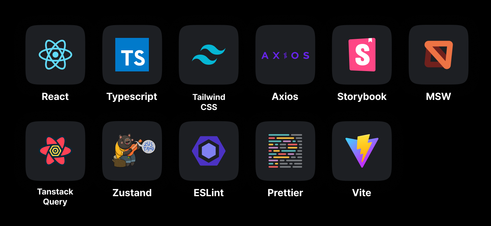

<br/>

### Backend


<br/>

### DevOps

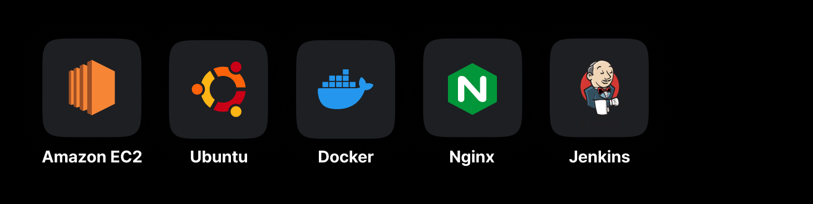

<br/>

### Tools

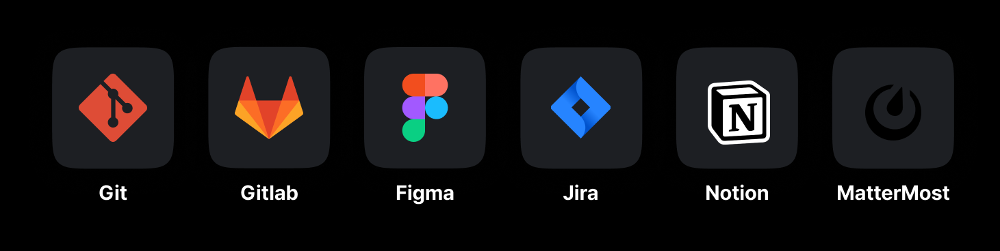

<br/>

## 💡 주요 기능

<table style="word-break: keep-all;">
<tr ><th style="text-align:center;">기능</th><th>내용</th></tr>
<tr>
  <td style="text-align:center;">가족 상태 조회</td>
  <td>우리 집에서 가족 구성원들의 최근 설정한 펭귄 상태를 조회할 수 있습니다.</td>
</tr>

<tr>
  <td style="text-align:center;">가족 꾸욱 누르기 & 메시지 보내기</td>
  <td>우리 집에서 가족 구성원들 중 하나의 펭귄에 클릭하여 꾸욱 누르기 또는 메시지를 보낼 수 있습니다. 위 기능을 사용할 시, 해당 구성원에게 알림이 전송됩니다.</td>
</tr>

<tr>
  <td style="text-align:center;">나의 상태 & 악세서리 변경</td>
  <td>나의 펭귄에서 펭귄을 클릭하여 상태 & 악세서리를 변경할 수 있습니다.</td>
</tr>

<tr>
  <td style="text-align:center;">개인 마음함</td>
  <td>나의 펭귄에서 마음함을 클릭하여 받은 메시지와 보낸 메시지 목록을 조회할 수 있습니다. 받은 메시지 목록에서 스피커를 클릭하면 TTS를 통해 펭귄 목소리를 들을 수 있습니다.</td>
</tr>

<tr>
  <td style="text-align:center;">가족 그룹 초대</td>
  <td>나의 펭귄에서 설정을 클릭하여 가족 코드를 카카오톡을 통해 공유하여 초대할 수 있습니다. 공유 받은 가족 구성원은 바로 가족 그룹에 참여할 수 있습니다.</td>
</tr>

<tr>
  <td style="text-align:center;">소식 등록</td>
  <td>( 나의 펭귄 & 우리 집 )에서 상단 카메라 아이콘을 클릭하여 찰영 및 앨범 이미지를 선택하여 등록할 수 있습니다. 등록이 완료되면 가족들에게 알림 메시지가 전송됩니다.</td>
</tr>

<tr>
  <td style="text-align:center;">소식 조회</td>
  <td>우리 집에서 소식 확인을 클릭하여 가족 구성원들이 등록된 소식을 조회 할 수 있습니다. 등록된 소식은 24시간 이내에만 유효합니다.</td>
</tr>

<tr>
  <td style="text-align:center;">소식 반응</td>
  <td>등록된 소식들에 대해 반응 조회 및 반응할 수 있습니다.</td>
</tr>

<tr>
  <td style="text-align:center;">소식 보관</td>
  <td>등록된 소식들을 보관함에 보관할 수 있습니다.</td>
</tr>

<tr>
  <td style="text-align:center;">보관된 소식 조회</td>
  <td>온실에서 보관함을 클릭하여 보관된 소식들을 조회할 수 있습니다.</td>
</tr>

<tr>
  <td style="text-align:center;">민들레 경험치 조회</td>
  <td>우리 집에서 온실을 클릭하여 민들레 경험치와 상세 내역을 조회할 수 있습니다. 경험치 수치가 해당 레벨 기준보다 같거나 높다면 성장 버튼이 활성화 되며 가족 구성원들에게 알림이 전송됩니다.</td>
</tr>

<tr>
  <td style="text-align:center;">민들레 레벨업</td>
  <td>가족들과 상호작용을 통해 경험치를 쌓으면 민들레를 성장시킬 수 있습니다.</td>
</tr>

<tr>
  <td style="text-align:center;">알림 서비스</td>
  <td>( 나의 펭귄 & 우리 집 )에서 알림을 클릭하여 받은 알림 목록을 조회할 수 있습니다. <br/>
  ( 꾸욱 누르기, 레벨 업 버튼 활성화, 레벨 업 누르기, 소식 등록, 메시지 수신 )에 대한 알림을 받을 수 있습니다.</td>
</tr>

<tr>
  <td style="text-align:center;">애정 메시지 자동 전송</td>
  <td>마지막 소식 업로드 시점에서 24시간 이상 새로운 소식이 없는 경우 가족 구성원 중 한 명에게 랜덤으로 애정 표현이 담긴 메시지가 자동으로 전송됩니다. 이때, 메시지 발신자(소식을 업로드하지 않은 사용자)와 수신자(랜덤으로 선정된 가족 구성원)에게 알림이 전송됩니다.</td>
</tr>

<tr>
  <td style="text-align:center;">알림 서비스</td>
  <td>( 나의 펭귄 & 우리 집 )에서 알림을 클릭하여 받은 알림 목록을 조회할 수 있습니다. <br/>
  ( 꾸욱 누르기, 레벨 업 버튼 활성화, 레벨 업 누르기, 소식 등록, 메시지 수신 )에 대한 알림을 받을 수 있습니다.</td>
</tr>

</table>

<br/>

<div id="4"></div>

## 📂 프로젝트 구상도

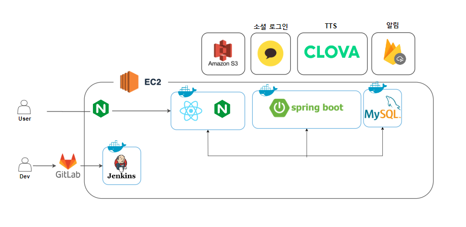

<br/>

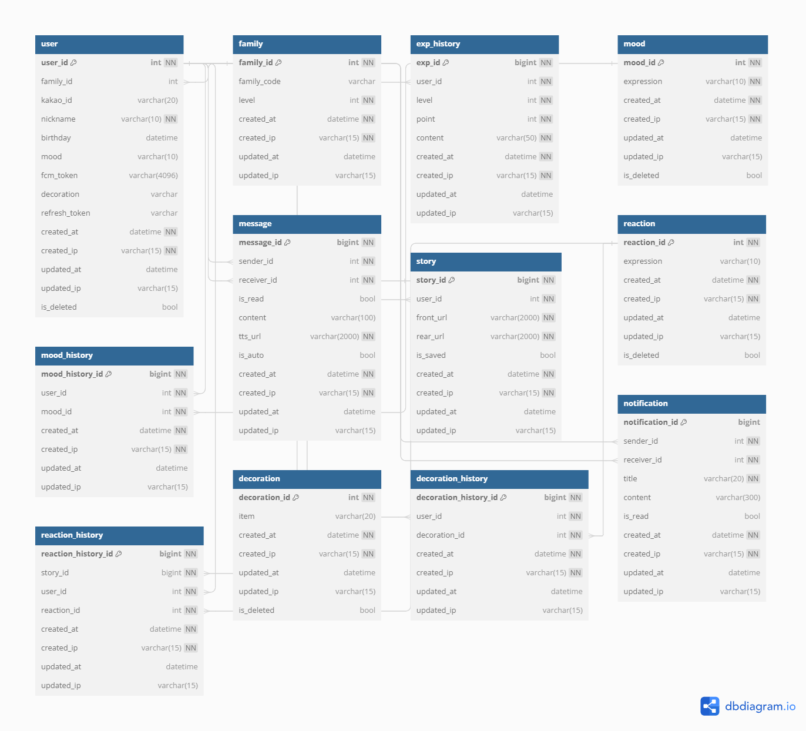

<br/>

<div id="5"></div>

## 🖥️ 서비스 화면

<table style="border: 2px; text-align:center;">
  <tr style="text-align:center;">
    <td> 회원가입 </td>
    <td> 가족 코드 공유 </td>
    <td> 튜토리얼 </td>
  </tr>
  <tr>
    <td>
     
    </td>
    <td>
      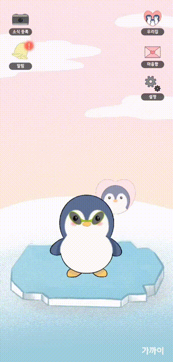
    </td>
    <td>
      
    </td>
  </tr>
</table>

<br/>
<br/>

<table style="border: 2px; text-align:center;">
  <tr style="text-align:center;">
    <td> 가족 상태 조회 </td>
    <td> 꾸욱 누르기 </td>
    <td> 메시지 전송 </td>
    <td> 안 읽은 메시지 조회 </td>
  </tr>
  <tr>
   <td>
 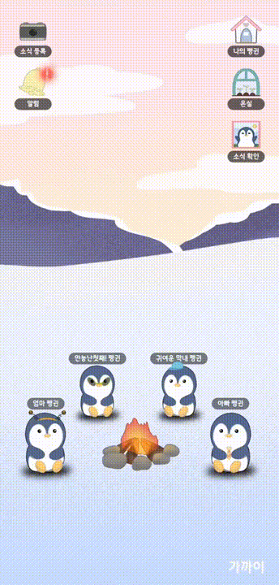
    </td>
    <td>
 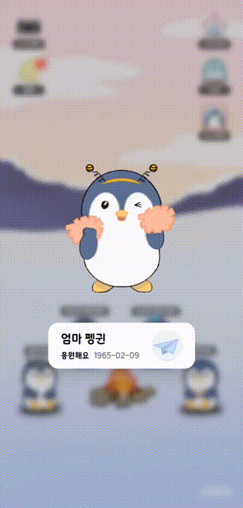
    </td>
    <td> 
 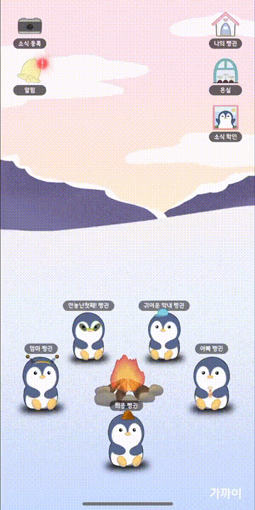
    </td>
    <td> 
 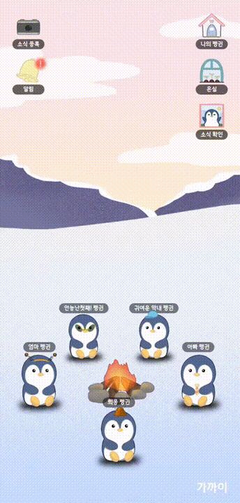
    </td>
  </tr>
</table>

<table style="border: 2px; text-align:center;">
  <tr style="text-align:center;">
    <td> 소식 등록 </td>
    <td> 소식 조회 및 반응 등록 </td>
    <td> 애정 메시지 </td>
    <td> 펭귄 꾸미기 </td>
  </tr>
  <tr>
   <td>
 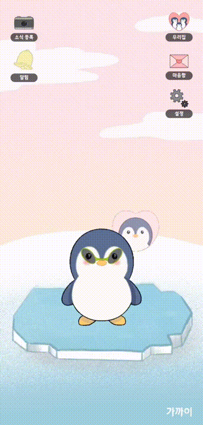
    </td>
    <td>
 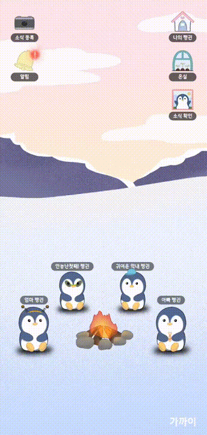
    </td>
    <td> 
 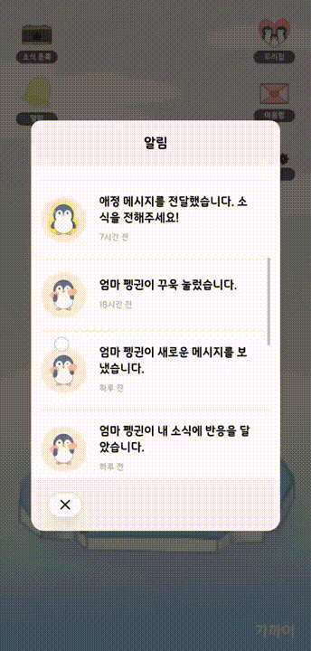
    </td>
    <td> 
 
    </td>
  </tr>
</table>

<table style="border: 2px; text-align:center;">
  <tr style="text-align:center;">
    <td> 민들레 성장 </td>
    <td> 민들레 성장 과정 </td>
    <td> 경험치 내역 </td>
    <td> 보관된 소식 조회 </td>
  </tr>
  <tr>
   <td>
 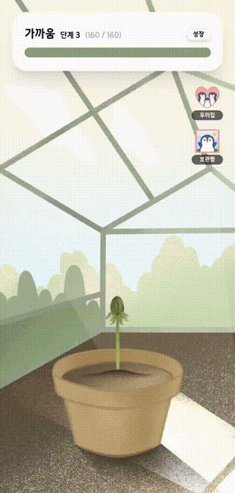
    </td>
    <td>
 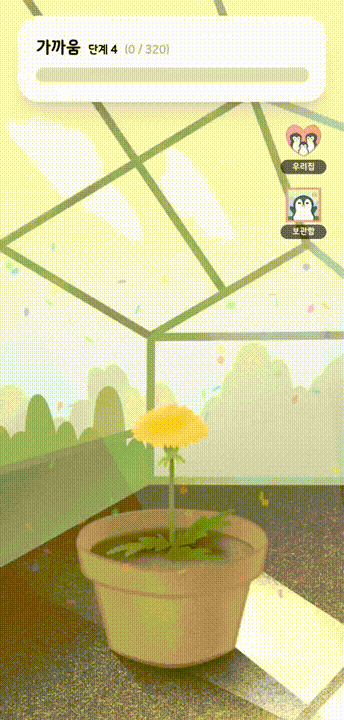
    </td>
    <td> 
 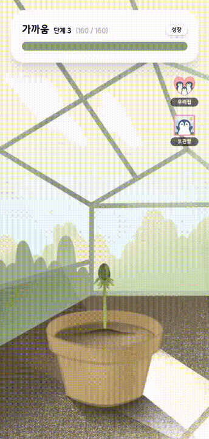
    </td>
    <td> 
 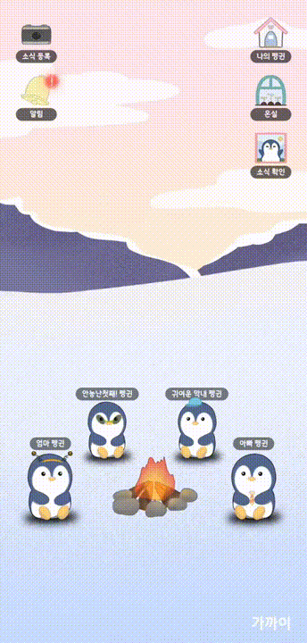
    </td>
  </tr>
</table>

<br/>
<br/>

<div id="6"></div>

## 👨🏻‍💻 개발 팀 소개

### Backend

<table>
  <tr>
    <td align="center" width="120px">
      <a href="https://github.com/Ryujy" target="_blank">
        
      </a>
    </td>
    <td align="center" width="120px">
      <a href="https://github.com/yeaaaaahhhhh" target="_blank">
        
      </a>
    </td>
    <td align="center" width="120px">
      <a href="https://github.com/syhan7516" target="_blank">
        
      </a>
    </td>
  </tr>

  <tr>
    <td align="center">
      <a href="https://github.com/Ryujy" target="_blank">
       류지윤
      </a>
      </td>
    <td align="center">
      <a href="https://github.com/yeaaaaahhhhh" target="_blank">
        김예현
      </a>
    </td>
     <td align="center">
      <a href="https://github.com/syhan7516" target="_blank">
       신영한
      </a>
    </td> 
  </tr>

  <tr>
    <td align="center">소식 & 반응 (등록, 조회, 보관) <br/>
나의 펭귄 (사용자 정보 조회, 상태 및 아이템 변경) <br/>
우리 집 (가족 정보 조회) <br/>
메시지 (전송, 조회, TTS 변환 및 조회) <br/>
자동 애정 메시지 전송 <br/>
    </td>
    <td align="center">자동배포 파이프라인 환경 구축 <br/>
      nginx 포트포워딩 설정 <br/>
      경험치 도메인 백엔드 구현
    </td>
    <td align="center">유저 도메인 및 인증, 인가 <br/>
전반적인 가족 및 알림 도메인 <br/>
이벤트에 따른 FCM 알림 전송 기능
    </td>
  </tr>

</table>

### Frontend

<table>
  <tr>
    <td align="center" width="120px">
      <a href="https://github.com/HeewonYoun" target="_blank">
        
      </a>
    </td>
    <td align="center" width="120px">
      <a href="https://github.com/hyun812" target="_blank">
        
      </a>
    </td>
    <td align="center" width="120px">
      <a href="https://github.com/dlgmldnd017" target="_blank">
        
      </a>
    </td>
  </tr>

  <tr>
     <td align="center">
      <a href="https://github.com/HeewonYoun" target="_blank">
       윤희원
      </a>
       <td align="center">
      <a href="https://github.com/hyun812" target="_blank">
        이승현
      </a>
    </td>
     <td align="center">
      <a href="https://github.com/dlgmldnd017" target="_blank">
       이희웅
      </a>
    </td> 
  </tr>

  <tr>
    <td align="center">전체 디자인 <br/>
      온실 페이지 <br/>
      소식 조회 및 반응 등록
    </td>
    <td align="center">FCM, 알림 <br/>
      카메라 전후면 소식 등록 <br/>
      우리집, 나의 펭귄 페이지
    </td>
    <td align="center">회원 관리 <br/>
      설정, 알림 페이지 <br/>
      스플래쉬
    </td>
  </tr>

</table>

<br />

<div id="7"></div>

## 🗓️ 개발 기간 및 일정

24.04.08. ~ 24.05.20

<br />

<div id="8"></div>

## 📂 디렉터리 구조

### Front-end

```
📁─src
    ├─apis
    ├─assets
    │  ├─dandelion
    │  ├─deco
    │  ├─expression
    │  ├─homebackground
    │  ├─icons
    │  ├─lottie
    │  ├─mood
    │  └─mybackground
    ├─components
    │  ├─@common
    │  │  └─Toast
    │  ├─familycode
    │  ├─greenhouse
    │  ├─home
    │  ├─login
    │  ├─playground
    │  │  └─modal
    │  ├─signup
    │  ├─splash
    │  ├─story
    │  └─tutorial
    ├─constants
    ├─hooks
    │  ├─@common
    │  ├─auth
    │  ├─family
    │  ├─greenhouse
    │  ├─message
    │  ├─my
    │  ├─notification
    │  ├─playground
    │  └─story
    ├─mocks
    │  └─api
    │      ├─data
    │      └─handlers
    ├─pages
    │  ├─error
    │  ├─familycode
    │  ├─greenhouse
    │  ├─home
    │  ├─login
    │  ├─my
    │  ├─private
    │  ├─register
    │  ├─signup
    │  ├─splash
    │  ├─story
    │  └─tutorial
    ├─services
    │  ├─auth
    │  ├─family
    │  ├─greenhouse
    │  ├─message
    │  ├─my
    │  ├─notification
    │  ├─playground
    │  └─story
    ├─stores
    ├─types
    │  └─model
    └─utils
```

### Back-end

```
📂 main
├─java
│  └─com
│      └─abbboo
│          └─backend
│              ├─domain
│              │  ├─decoration
│              │  │  ├─controller
│              │  │  ├─dto
│              │  │  ├─entity
│              │  │  ├─repository
│              │  │  └─service
│              │  ├─expHistory
│              │  │  ├─controller
│              │  │  ├─dto
│              │  │  ├─entity
│              │  │  ├─repository
│              │  │  └─service
│              │  ├─family
│              │  │  ├─controller
│              │  │  ├─dto
│              │  │  ├─entity
│              │  │  ├─repository
│              │  │  └─service
│              │  ├─message
│              │  │  ├─controller
│              │  │  ├─dto
│              │  │  ├─entity
│              │  │  ├─repository
│              │  │  └─service
│              │  └─mood
│              │  │   ├─controller
│              │  │   ├─dto
│              │  │   ├─entity
│              │  │   ├─repository
│              │  │   └─service
│              │  └─notification
│              │  │   ├─controller
│              │  │   ├─dto
│              │  │   ├─entity
│              │  │   ├─repository
│              │  │   └─service
│              │  └─reaction
│              │  │   ├─entity
│              │  │   └─repository
│              │  └─story
│              │  │   ├─controller
│              │  │   ├─dto
│              │  │   ├─entity
│              │  │   ├─repository
│              │  │   └─service
│              │  └─user
│              │  │   ├─controller
│              │  │   ├─dto
│              │  │   ├─entity
│              │  │   ├─repository
│              │  │   └─service
│              └─global
│                  ├─auth
│                  ├─base
│                  ├─config
│                  ├─error
│                  ├─event
│                  ├─filter
│                  └─util
│                  │  └─ClovaUtil
│                  │  ├─CookieUtil
│                  │  ├─JwtUtil
│                  │  └─S3Util
│                  └─BackendApplication
└─resources
    ├─static
    └─templates
```

<br />

<div id="9"></div>

## 📃 산출물

### [1. 기능 명세서](https://lumpy-crayon-fd9.notion.site/c658d061623c45a597307f271c96f816)

### [2. 화면 설계서](https://www.figma.com/design/qbSZST9JDtiJJCTCAuDZLT/%EC%95%84%EB%BE%B0-team-library?node-id=0%3A1&t=cPwpXuYDOg9tVXfq-1)

### [3. API 명세서](https://lumpy-crayon-fd9.notion.site/API-ba05c9c55ae441eda2939655e1cc7d06)

### [4. ERD](https://lumpy-crayon-fd9.notion.site/ERD-42bfedc311554109bf63fd5c12a5566e?pvs=4)
